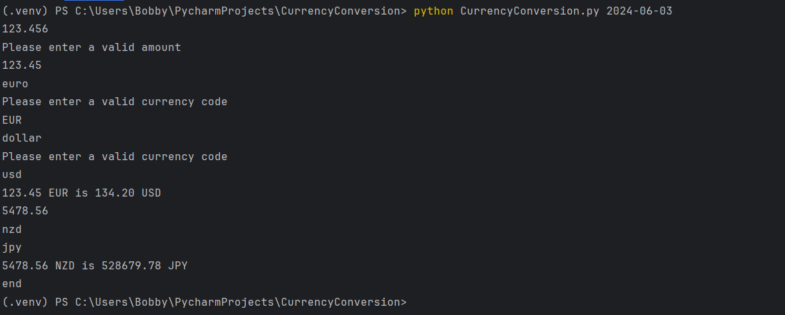

# Currency Conversion App

### Currency Conversion is a CLI application that integrates with [Fast Forex](https://fastforex.io/) API and lets the user convert currencies with exchange rates from past dates.
The application is build with Python

- You can run the application with the following command: "python CurrencyConversion.py {date}}" where date is in the following format "YYYY-MM-DD"
- Then the user inputs Amount, Base Currency and Target Currency and receives the converted amount

### Screenshot:

### Basic technical description
- The application uses Fast Forex API for fetching historical conversion rates for different currency pairs. API key is stored in a config.json file
- Currency codes in ISO 4217 are loaded from currency_codes.csv file
- Each successful conversion is saved in conversion.json file
- All conversion rates are cached and used for similar requests instead of making API calls
